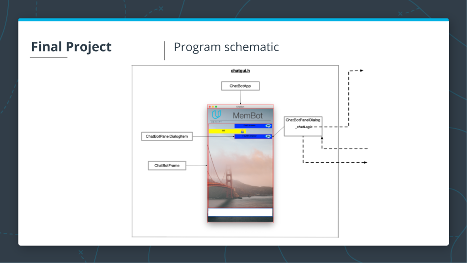
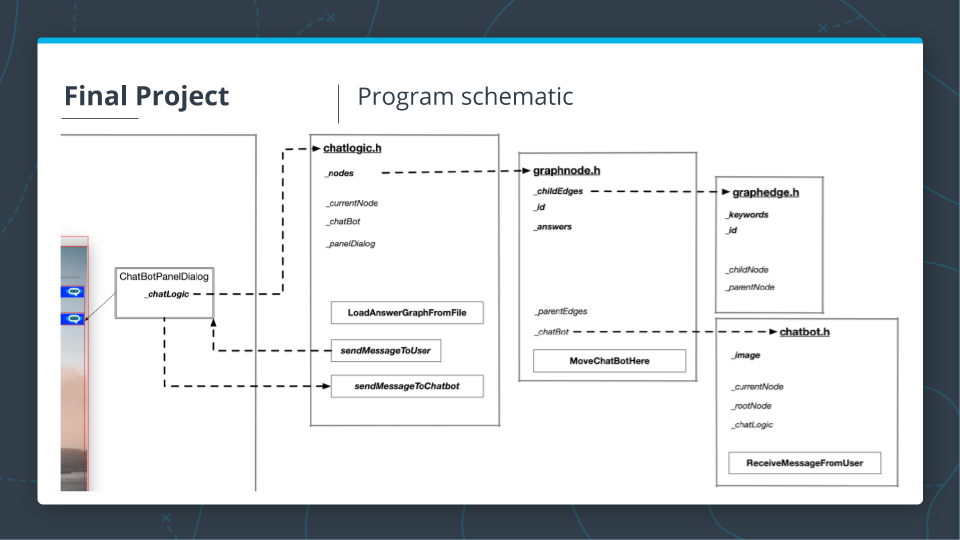

# Udacity - C++ NanoDegree: Memory management chatbot

Created: December 22, 2021 7:37 PM

## Overview


We have been provided with an existing ChatBot program, which is able to discuss some memory management topics based on the content of a knowledge base. The ChatBot code creates a dialogue where users can ask questions about some aspects of memory management in C++. After the knowledge base of the chatbot has been loaded from a **text file**, a **knowledge graph** representation is created in computer memory, where **chatbot answers** represent the **graph** **nodes,** and **user queries** represent the **graph edges**. After a user query has been sent to the chatbot, the Levenshtein distance is used to identify the most probable answer.

The code is fully functional as-is and uses raw pointers to represent the knowledge graph and interconnections between objects throughout the project. However, no advanced memory management concepts such as, smart pointers, move semantics, and ownership, have been used in the code. 

This project optimises the ChatBot program from a memory management perspective. 

## Project schematic and class structure


The above image shows the general outline of how the project is supposed to work. 

On the right hand side, when the program starts, the chatbot tells you what topics the user can ask of it. Initially, the two options are pointers, and the C++ memory model. 

On the left hand side, we see the answer graph that is structured according to the layout of the knowledge base. We start at the initial root node (n0). The red circle denotes the current position of the **chatbot**. Based on the location of the root node, we have two options, traverse over the edge, e0, to node, n1, or e1 to n2. **The chatbot moves accordingly.** 



Above is the project schematic. We have **four** major items, **ChatBotApp, ChatBotFrame, ChatBotPanelDialog, ChatBotPanelDialogItem.**

1. **ChatBotApp:**
    
    Encapsulates the **main() method** of the program in **WxWidgets.** We do not have a **main() method.** It is encapsulated in an internal simulation loop. What the framework gives you is access to the program itself which is already running in a loop which holds for keyboard events, mouse events that refresh the graphics 
    
2. **ChatBotFrame:**
    
    Represents the entire window which is refreshed every couple of milliseconds. Inside **ChatBotFrame**, we have **two** items:
    
    1. **ChatBotPanelDialog:**
        
        Manages the answers of the **chatbot**, and your answers. 
        
        Entire logic surrounding **chatbot** is encapsulated in a member variable, **_chatLogic.**
        
        **_chatLogic** manages the interface between user and the **chatbot**. 
        
    2. **ChatBotPanelDialogItem:** 
        
        The answers for example, are a **ChatBotPanelDialogItem.**
        



The program schematic shown above is **what the code structure needs to be after we have optimised the ChatBot program.**

The **bold member variables** in the above image, ****are **owned** by the classes (ownership relation). 

The **non-bold** are **handles** to other instances (no ownership). 

### chatlogic.h/chatlogic.cpp

This class serves as the intermediary class between the graphical user interface (on the left side of above image), and the **chatbot** from which the **answer has to be retrieved**. (on the extreme right side of the above image). 

The **_chatLogic member** (of the **ChatBotPanelDialog class**) is found in **chatlogic.h/chatlogic.cpp.**

1. **_nodes (owned): chatlogic class** owns a couple of nodes, **_nodes.** The nodes represent the answers in the knowledge/answer graph. 
2. **LoadAnswerGraphFromFile:** Basically sets up the entire network and connects nodes with edges. 
3. **_currentNode:** This is a pointer to a current node. 
4. **sendMessageToUser:** Basically takes the reply that **chatbot** has generated, sends back to user and the answer is displayed as a yellow box in the GUI.
5. **sendMessageToChatBot:** When you enter a question and post it to the chatbot, this message is sent to the **chatbot** by this method. 
6. **_chatBot:** We have a pointer to the **chatbot.** In order to send messages to, and retrieve answers from the **chatbot,** we need a handle to the **chatbot.**
7. **_panelDialog:** We have a pointer to the **ChatBotPanelDialog.**

### graphnode.h/graphnode.cpp

1. **_childEdges (owned):** In a node, we have a number of edges leading from the node, to the child nodes (successive edges)
2. **_parentEdges:** In a node, we have edges leading to the node (preceding edges). There is no ownership relation here - just a handle. 
3. **_chatBot:** a handle to the **chatbot.** The chatbot moves from node to node. Therefore, we have a passing of ownership here. When a chatbot moves from a certain node, the node from which the the chatbot moves away loses ownership of the chatbot. The chatbot moves to the next node, and this node accepts the ownership of the chatbot. The chatbot handle at the previous node gets invalidated. 
4. **_answers(owned):** The answers that the **chatbot** can provide are contained in this member. 

### graphedge.h/graphedge.cpp

1. **_keywords (owned):** We have a couple of keywords under each edge to decide which edge to traverse over. 
2. **_childNode:** The handle to the subsequent node.
3. **_parentNode:** The handle to the preceding node. 

### chatbot.h/chatbot.cpp

1. **_image (owned):** This class is responsible for **handling an image,**   . This is the image we see on the chatbot app. 
    
    For the sake of showing how memory handling on the heap works, the **chatbot** will be responsible for handling its own image. The image has been allocated on the heap. We always have to make sure that when the **chatbot** moves, the handle to this heap allocated image is not lost, but saved in a meaningful manner - for example, move semantics so that chatbot image gets displayed with each new answer despite the chatbot having been moved from one node to the next. 
    
2. **_currentNode:** A pointer to the current node
3. **_rootNode:** A pointer to the root node. We need this when we reach a node that does not have child edges and thus child nodes, the **chatbot** needs to be reset to the start of the network. 
4. **_chatLogic:** We have a pointer to the chatlogic instance. This will be needed to pass messages back to the GUI. 
5. **ReceiveMessageFromUser:** This is needed to generate the response which then needs to be sent to **chatlogic instance.** 

## Code overview

**ChatBotApp::OnInit()** is the starting point (chatgui.h/chatugui.cpp).
It instantiates a **ChatBotFrame.**
This instantiates a **ChatBotPanelDialog object.**
The construction of a **ChatBotPanelDialog object** involves:

1. Creating a **ChatLogic instance (_chatLogic = std::make_unique<ChatLogic>();).**
    1. A **ChatLogic object exclusively** owns a vector of pointers to **GraphNode instances, _nodes.** 
    It has a data handle to the **current** **GraphNode instance, _rootNode.** 
    It has a data handle to a **ChatBot instance, _chatBot.**
    It has a data handle to the **ChatBotPanelDialog instance, _panelDialog.** 
2. Then, **_chatLogic’s SetPanelDialogHandle(this) method** is called. 
3. Next, **_chatLogic’s LoadAnswerGraphFromFile() method** is called. 
    1. Here, we loop through all the lines in the answer graph and create instances of **GraphNodes (std::make_unique<GraphNode>(id))** and push them into the _nodes vector (of the **ChatLogic instance).** 
        1. **GraphNode instance exclusively** owns the edges to its subsequent/child nodes (child edges); i.e. **exclusively** owns a vector of pointers to **GraphEdge instances, _childEdges.**
        It has a data handle to a vector of **GraphEdge instances, _parentEdges (not exclusively owned).**
        it has a **ChatBot instance** that lives on the stack (not a pointer; an actual object)
    2. We also create **GraphEdge instances** (**auto edge = std::make_unique<GraphEdge>(id).** For these instances, we set the parent node and the child node. That is to say that **GraphEdge** has data handles to **GraphNode instances, _childNode, and _parentNode.** 
    3. After we have created the **GraphEdge** **instances**, we pass them to the **GraphNode objects** in the **_nodes vector.**
        1. The method **AddEdgeToParent()** takes a **raw** **pointer to a GraphEdge object** and pushes this pointer to the **_parentEdges vector.** Remember **GraphEdge object** has been created on the stack as a smart pointer object. So we pass this edge into the methods as **edge.get()** (to obtain the raw pointer to the **GraphEdge object).** 
        2. The method **AddEdgeToChild()** takes a smart pointer to a **GraphEdge object** and pushes this smart pointer to the **_childEdges vector.** We use move semantics because we are passing around unique smart pointers.
    4. Next, we identify the **root GraphNode instance** (i.e. no incoming **GraphEdge instances**). 
    5. Then, we create a **ChatBot instance** on the stack, **chatBot**. 
        1. We set the **_chatLogic handle** of **chatBot** to **this** using the **SetChatLogicHandle method** of **chatBot.** 
        2. We also set the **_rootNode handle** of **chatBot** to the previously identified **root GraphNode** using the **SetRootNode method** of **chatBot.** 
    6. Finally, to the identified **root GraphNode,** we “move” the **chatBot** using the **MoveChatBotHere method** of **GraphNode.**


    ## Dependencies for Running Locally
* cmake >= 3.11
  * All OSes: [click here for installation instructions](https://cmake.org/install/)
* make >= 4.1 (Linux, Mac), 3.81 (Windows)
  * Linux: make is installed by default on most Linux distros
  * Mac: [install Xcode command line tools to get make](https://developer.apple.com/xcode/features/)
  * Windows: [Click here for installation instructions](http://gnuwin32.sourceforge.net/packages/make.htm)
* gcc/g++ >= 5.4
  * Linux: gcc / g++ is installed by default on most Linux distros
  * Mac: same deal as make - [install Xcode command line tools](https://developer.apple.com/xcode/features/)
  * Windows: recommend using [MinGW](http://www.mingw.org/)
* wxWidgets >= 3.0
  * Linux: `sudo apt-get install libwxgtk3.0-gtk3-dev libwxgtk3.0-gtk3-0v5`. If you are facing unmet dependency issues, refer to the [official page](https://wiki.codelite.org/pmwiki.php/Main/WxWidgets30Binaries#toc2) for installing the unmet dependencies.
  * Mac: There is a [homebrew installation available](https://formulae.brew.sh/formula/wxmac).
  * Installation instructions can be found [here](https://wiki.wxwidgets.org/Install). Some version numbers may need to be changed in instructions to install v3.0 or greater.

## Basic Build Instructions

1. Clone this repo.
2. Make a build directory in the top level directory: `mkdir build && cd build`
3. Compile: `cmake .. && make`
4. Run it: `./membot`.

## Project Task Details

There are five additional major student tasks in the Memory Management chatbot project, which are:

### Task 1 : Exclusive Ownership 1
In file `chatgui.h` / `chatgui.cpp`, make `_chatLogic` an exclusive resource to class `ChatbotPanelDialog` using an appropriate smart pointer. Where required, make changes to the code such that data structures and function parameters reflect the new structure. 

### Task 2 : The Rule Of Five
In file `chatbot.h` / `chatbot.cpp`, make changes to the class `ChatBot` such that it complies with the Rule of Five. Make sure to properly allocate / deallocate memory resources on the heap and also copy member data where it makes sense to you.  In each of the methods (e.g. the copy constructor), print a string of the type "ChatBot Copy Constructor" to the console so that you can see which method is called in later examples. 

### Task 3 : Exclusive Ownership 2
In file `chatlogic.h` / `chatlogic.cpp`, adapt the vector `_nodes` in a way that the instances of `GraphNodes` to which the vector elements refer are exclusively owned by the class `ChatLogic`. Use an appropriate type of smart pointer to achieve this. Where required, make changes to the code such that data structures and function parameters reflect the changes. When passing the `GraphNode` instances to functions, make sure to not transfer ownership and try to contain the changes to class `ChatLogic` where possible. 

### Task 4 : Moving Smart Pointers

In files `chatlogic.h` / `chatlogic.cpp` and `graphnode.h` / `graphnode.cpp` change the ownership of all instances of `GraphEdge` in a way such that each instance of `GraphNode` exclusively owns the outgoing `GraphEdges` and holds non-owning references to incoming `GraphEdges`. Use appropriate smart pointers and where required, make changes to the code such that data structures and function parameters reflect the changes. When transferring ownership from class `ChatLogic`, where all instances of `GraphEdge` are created, into instances of `GraphNode`, make sure to use move semantics. 

### Task 5 : Moving the ChatBot

In file `chatlogic.cpp`, create a local `ChatBot` instance on the stack at the bottom of function `LoadAnswerGraphFromFile`. Then, use move semantics to pass the `ChatBot` instance into the root node. Make sure that `ChatLogic` has no ownership relation to the `ChatBot` instance and thus is no longer responsible for memory allocation and deallocation. Note that the member `_chatBot` of `ChatLogic` remains so it can be used as a communication handle between GUI and `ChatBot` instance. Make all required changes in files `chatlogic.h` / `chatlogic.cpp` and `graphnode.h` / `graphnode.cpp`. When the program is executed, messages on which part of the Rule of Five components of `ChatBot` is called should be printed to the console. When sending a query to the `ChatBot`, the output should look like the following: 

```
ChatBot Constructor
ChatBot Move Constructor
ChatBot Move Assignment Operator
ChatBot Destructor
ChatBot Destructor 
```